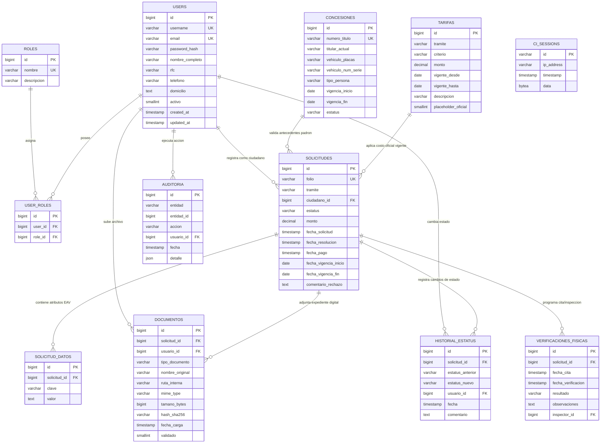

# Documentación Integral y Manual Técnico del Sistema
## Ventanilla Digital de Movilidad y Transporte Municipal

**Gobierno Municipal de Uriangato, Guanajuato**  
**Dirección de Movilidad y Transporte**  
**Versión del Sistema:** 2.0.0 (Producción / Vercel Serverless + Supabase PostgreSQL)  
**Clasificación:** Documento Técnico de Arquitectura, Datos y Operación  
**Última Actualización:** Agosto 2026

---

## Índice General
1. [Identificación y Ficha Técnica del Proyecto](#1-identificación-y-ficha-técnica-del-proyecto)
2. [Historia de Construcción, Enfoque y Metodología](#2-historia-de-construcción-enfoque-y-metodología)
3. [Pila Tecnológica Exhaustiva](#3-pila-tecnológica-exhaustiva)
4. [Arquitectura de Software y Capas del Sistema](#4-arquitectura-de-software-y-capas-del-sistema)
5. [Modelo Entidad-Relación (MER) y Diccionario de Datos](#5-modelo-entidad-relación-mer-y-diccionario-de-datos)
6. [Ciclo de Vida de una Petición (Request Lifecycle)](#6-ciclo-de-vida-de-una-petición-request-lifecycle)
7. [Catálogo y Especificación Detallada de los 7 Trámites](#7-catálogo-y-especificación-detallada-de-los-7-trámites)
8. [Subsistemas Transversales Especializados](#8-subsistemas-transversales-especializados)
9. [Inventario de Rutas y Matriz de Control de Acceso (RBAC)](#9-inventario-de-rutas-y-matriz-de-control-de-acceso-rbac)
10. [Guía de Despliegue, Configuración y Pruebas Automatizadas](#10-guía-de-despliegue-configuración-y-pruebas-automatizadas)

---

## 1. Identificación y Ficha Técnica del Proyecto

* **Nombre Oficial:** Ventanilla Digital de Movilidad y Transporte de Uriangato.
* **Institución Responsable:** H. Ayuntamiento de Uriangato, Gto. — Dirección de Movilidad y Transporte.
* **Propósito Central:** Modernizar, transparentar y digitalizar al 100% la gestión, recepción, validación documental, cotización, inspección física y resolución de los trámites y servicios de transporte público, carga y vialidad en el municipio.
* **Público Objetivo:** Ciudadanos del municipio, concesionarios de transporte colectivo y suburbano, transportistas de carga comercial y funcionarios públicos municipales (operadores de ventanilla y administradores).
* **Marco Jurídico de Referencia:** Ley de Movilidad del Estado de Guanajuato y sus Municipios, Reglamento de Tránsito y Transporte Municipal de Uriangato, y Ley de Ingresos para el Municipio de Uriangato, Gto.

---

## 2. Historia de Construcción, Enfoque y Metodología

El sistema fue diseñado y construido bajo principios rigurosos de ingeniería de software gubernamental:

1. **Enfoque Centrado en el Ciudadano (UX/UI *Mobile-First*):**
   * Formularios estructurados por secciones lógicas numeradas.
   * Campos con validaciones inmediatas en español natural e indicaciones de formato (placas, VIN, RFC, tipos de archivo).
   * Tarjetas de costos estáticas que informan la tarifa vigente sin solaparse ni bloquear la visualización en dispositivos móviles o escritorios.
2. **Arquitectura Desacoplada y Resiliente (Serverless Ready):**
   * El código está optimizado para funcionar en entornos sin estado (*stateless* como Vercel Serverless) y servidores tradicionales (Apache / Nginx).
   * La sesión de usuario y los tokens de seguridad se persisten directamente en la base de datos relacional (`ci_sessions`), garantizando que la navegación y los pagos no se pierdan entre reinicios de contenedores o funciones lambda.
3. **Trazabilidad e Inmutabilidad de Expedientes:**
   * Cada archivo digitalizado (PDF, JPG, PNG) se valida por tipo MIME real y se le calcula su huella criptográfica **SHA-256**, evitando adulteraciones y garantizando auditoría legal.
   * Cada cambio de estatus de una solicitud queda registrado en una bitácora histórica inmutable (`historial_estatus`).
4. **Patrón de Extensibilidad (Feature Flags):**
   * Trámites o funcionalidades con validación legal en proceso (como la Cesión de Derechos `UR-TT-T-06`) se controlan mediante banderas de características configurables por entorno (`FeatureFlags.php`), permitiendo despliegues controlados sin interrumpir la operación general.

---

## 3. Pila Tecnológica Exhaustiva

| Componente | Tecnología | Versión | Justificación Técnica |
|---|---|---|---|
| **Lenguaje Backend** | **PHP** | `8.2.25+` | Tipado estricto (`declare(strict_types=1)`), alto rendimiento, manejo seguro de excepciones y amplia compatibilidad. |
| **Framework Web** | **CodeIgniter 4** | `4.5.8` | Arquitectura ligera, consumo mínimo de memoria, excelente soporte de enrutamiento, validación nativa y protección contra vulnerabilidades (CSRF, XSS, SQL Injection). |
| **Motor de Base de Datos** | **PostgreSQL (Supabase)** | `15+` | Base de datos relacional de nivel empresarial con soporte transaccional ACID, conexiones seguras SSL y PgBouncer Transaction Pooler (puerto `6543`). |
| **Base de Datos Alternativa** | **MySQL / MariaDB** | `10.4+` | Compatible nativamente con dialecto MySQL para desarrollo local en XAMPP/Laragon. |
| **Diseño Frontend** | **Bootstrap 5 & Vanilla CSS** | `5.3.2` | Maquetación responsiva limpia, rejilla flexible (*grid system*) y hojas de estilo a la medida (`custom.css`) con variables CSS estructuradas. |
| **Iconografía** | **Bootstrap Icons** | `1.11.1` | Iconos vectoriales nítidos y accesibles para señalización de trámites, estados y documentos. |
| **Tipografía** | **Google Fonts (Inter)** | `300..800` | Legibilidad óptima en interfaces administrativas y pantallas de teléfonos inteligentes. |
| **Criptografía de Archivos** | **SHA-256 (PHP `hash_file`)** | Estándar | Firma digital de integridad de cada archivo subido al servidor. |
| **Gestión de Sesiones** | **Database Session Handler** | Nativo CI4 | Almacenamiento de sesiones en tabla `ci_sessions` en PostgreSQL/Supabase. |
| **Framework de Pruebas** | **PHPUnit** | `10.5.64` | Pruebas unitarias automatizadas y pruebas de integración de controladores y modelos. |

---

## 4. Arquitectura de Software y Capas del Sistema

El software sigue el patrón **MVC en Capas (Layered MVC Architecture)**:

```
┌─────────────────────────────────────────────────────────────────────────────┐
│                             CAPA DE PRESENTACIÓN                            │
│  - Vistas del Portal Ciudadano (app/Views/portal/)                          │
│  - Vistas del Panel Administrativo (app/Views/admin/)                       │
│  - Plantillas Maestras: portal.php, admin.php                              │
│  - Estilos del Sistema: public/css/custom.css                               │
└──────────────────────────────────────┬──────────────────────────────────────┘
                                       │ HTTP Requests / Form Data
                                       ▼
┌─────────────────────────────────────────────────────────────────────────────┐
│                         CAPA DE FILTROS Y SEGURIDAD                         │
│  - AuthFilter: Verifica sesión activa y vigencia.                           │
│  - AdminFilter: Restringe acceso exclusivo a administradores y operadores.  │
│  - CSRF Filter: Token anti-falsificación en todos los formularios POST.     │
└──────────────────────────────────────┬──────────────────────────────────────┘
                                       │ Petición Autorizada
                                       ▼
┌─────────────────────────────────────────────────────────────────────────────┐
│                          CAPA DE CONTROLADORES (MVC)                         │
│  - Portal: TramiteConcesionTransporteController (T-01)                      │
│            TramiteDespintadoController (T-02)                               │
│            TramiteOrdenPlaqueoController (T-03)                             │
│            TramitePermisoEventualController (T-04)                          │
│            TramiteCierreCalleController (T-05)                              │
│            TramiteCesionConcesionController (T-06)                          │
│            TramiteCargaDescargaController (T-07)                            │
│            PortalController, AuthController                                 │
│  - Admin:  AdminController, CatalogoTarifasController,                      │
│            CatalogoConcesionesController                                    │
└──────────────────────────────────────┬──────────────────────────────────────┘
                                       │
              ┌────────────────────────┴────────────────────────┐
              ▼                                                 ▼
┌──────────────────────────────┐              ┌──────────────────────────────┐
│     SERVICIOS Y LIBRERÍAS    │              │       MODELOS DE DATOS       │
│ - DocumentoUploader          │              │ - SolicitudModel             │
│ - TarifarioService           │              │ - SolicitudDatoModel         │
│ - FeatureFlags               │              │ - DocumentoModel             │
│ - AuditoriaModel             │              │ - ConcesionModel             │
│ - PdfService / QrCodeService │              │ - TarifaModel                │
│ - Validación (es/Validation) │              │ - VerificacionFisicaModel    │
└──────────────┬───────────────┘              │ - HistorialEstatusModel      │
               │                              │ - UserModel / RoleModel      │
               │                              └──────────────┬───────────────┘
               └───────────────────────┬─────────────────────┘
                                       ▼
┌─────────────────────────────────────────────────────────────────────────────┐
│                         CAPA DE PERSISTENCIA (DATOS)                        │
│  - PostgreSQL 15+ en Supabase (Pooler PgBouncer 6543)                       │
│  - Sistema de Archivos Seguro (WRITEPATH/uploads/documentos/)               │
└─────────────────────────────────────────────────────────────────────────────┘
```

---

## 5. Modelo Entidad-Relación (MER) y Diccionario de Datos

### 5.1 Diagrama Entidad-Relación (Mermaid)



---

### 5.2 Diccionario Exhaustivo de Tablas

#### 1. Tabla: `users`
Almacena las cuentas de usuarios de todos los roles (ciudadanos, operadores y administradores).
| Columna | Tipo de Dato | Nulo | Descripción y Restricciones |
|---|---|---|---|
| `id` | `BIGSERIAL` | NO | Llave primaria auto-incremental. |
| `username` | `VARCHAR(100)` | SÍ | Nombre de usuario único para acceso. |
| `email` | `VARCHAR(255)` | SÍ | Correo electrónico único del usuario. |
| `password_hash` | `VARCHAR(255)` | NO | Contraseña cifrada con `password_hash(..., PASSWORD_DEFAULT)`. |
| `nombre_completo` | `VARCHAR(180)` | SÍ | Nombre y apellidos del usuario o titular. |
| `rfc` | `VARCHAR(13)` | SÍ | Registro Federal de Contribuyentes (12 o 13 posiciones). |
| `telefono` | `VARCHAR(20)` | SÍ | Teléfono de contacto a 10 dígitos. |
| `domicilio` | `TEXT` | SÍ | Domicilio registrado en Uriangato o foráneo. |
| `activo` | `SMALLINT` | NO | `1` = Usuario activo, `0` = Inhabilitado. Default `1`. |
| `reset_token` | `VARCHAR(255)` | SÍ | Token temporal de recuperación de contraseña. |
| `reset_expira` | `TIMESTAMP` | SÍ | Fecha y hora límite del token de recuperación. |
| `created_at` / `updated_at` | `TIMESTAMP` | SÍ | Marcas de tiempo de creación y modificación. |

---

#### 2. Tabla: `roles`
Catálogo de perfiles y privilegios de acceso del sistema.
| Columna | Tipo de Dato | Nulo | Descripción |
|---|---|---|---|
| `id` | `BIGSERIAL` | NO | Llave primaria (`1`=administrador, `2`=operador_ventanilla, `3`=ciudadano). |
| `nombre` | `VARCHAR(50)` | NO | Identificador único del rol. |
| `descripcion` | `VARCHAR(250)` | SÍ | Descripción del alcance y facultades del rol. |

---

#### 3. Tabla: `user_roles`
Tabla intermedia que relaciona usuarios con sus respectivos roles (soporta multi-rol).
| Columna | Tipo de Dato | Nulo | Descripción |
|---|---|---|---|
| `id` | `BIGSERIAL` | NO | Llave primaria auto-incremental. |
| `user_id` | `BIGINT` | NO | FK hacia `users.id`. |
| `role_id` | `BIGINT` | NO | FK hacia `roles.id`. |
| **Restricción** | `UNIQUE(user_id, role_id)` | NO | Impide duplicidad de asignación de rol. |

---

#### 4. Tabla: `solicitudes`
Entidad transaccional central que registra cada trámite ingresado en la ventanilla digital.
| Columna | Tipo de Dato | Nulo | Descripción |
|---|---|---|---|
| `id` | `BIGSERIAL` | NO | Llave primaria interna. |
| `folio` | `VARCHAR(20)` | NO | Código alfanumérico institucional único (ej: `CD-20260830-1042`, `CONC-2026-0012`). |
| `tramite` | `VARCHAR(20)` | NO | Código del trámite: `UR-TT-T-01` a `UR-TT-T-07`. |
| `ciudadano_id` | `BIGINT` | NO | FK hacia `users.id` (quien ingresó el trámite). |
| `estatus` | `VARCHAR(50)` | NO | Estado del trámite: `Borrador`, `Pendiente de revisión`, `En revisión`, `Cita agendada`, `Verificado`, `Aprobada`, `Rechazada`, `Pagado`, `Vigente`, `Concluido`. |
| `monto` | `DECIMAL(12,2)` | SÍ | Importe en pesos mexicanos a pagar por concepto de derechos municipales. |
| `fecha_solicitud` | `TIMESTAMP` | NO | Fecha y hora en que se envió formalmente el trámite. |
| `fecha_resolucion` | `TIMESTAMP` | SÍ | Fecha y hora en que se aprobó o dictaminó el trámite. |
| `fecha_pago` | `TIMESTAMP` | SÍ | Fecha y hora de confirmación del pago de derechos. |
| `fecha_vigencia_inicio` | `DATE` | SÍ | Inicio del periodo de validez del permiso emitido. |
| `fecha_vigencia_fin` | `DATE` | SÍ | Término del periodo de validez del permiso emitido. |
| `comentario_rechazo` | `TEXT` | SÍ | Motivo detallado en caso de rechazo o prevención documental. |

---

#### 5. Tabla: `solicitud_datos`
Modelo flexible Entidad-Atributo-Valor (EAV) que almacena los campos dinámicos específicos de cada trámite.
| Columna | Tipo de Dato | Nulo | Descripción |
|---|---|---|---|
| `id` | `BIGSERIAL` | NO | Llave primaria. |
| `solicitud_id` | `BIGINT` | NO | FK hacia `solicitudes.id` con eliminación en cascada (`ON DELETE CASCADE`). |
| `clave` | `VARCHAR(100)` | NO | Nombre del campo (ej. `numero_titulo_concesion`, `calle_tramo`, `tipo_cierre`, `vehiculo_placas`, `tipo_persona`, etc.). |
| `valor` | `TEXT` | SÍ | Valor capturado por el usuario en el formulario. |

---

#### 6. Tabla: `documentos`
Expediente digital seguro asociado a cada solicitud.
| Columna | Tipo de Dato | Nulo | Descripción |
|---|---|---|---|
| `id` | `BIGSERIAL` | NO | Llave primaria. |
| `solicitud_id` | `BIGINT` | NO | FK hacia `solicitudes.id` (`ON DELETE CASCADE`). |
| `tipo_documento` | `VARCHAR(100)` | SÍ | Identificador del requisito (ej. `identificacion_oficial`, `factura_vehiculo`, `poliza_seguro`). |
| `nombre_original` | `VARCHAR(255)` | SÍ | Nombre original del archivo proporcionado por el usuario. |
| `ruta_interna` | `VARCHAR(255)` | NO | Nombre de archivo único UUID asignado por el sistema en almacenamiento. |
| `mime_type` | `VARCHAR(100)` | SÍ | `application/pdf`, `image/jpeg`, `image/png`. |
| `tamano_bytes` | `BIGINT` | SÍ | Tamaño del archivo en bytes (límite: 10 MB = 10,485,760 bytes). |
| `hash_sha256` | `VARCHAR(64)` | SÍ | Hash criptográfico SHA-256 para verificación de inmutabilidad. |
| `usuario_id` | `BIGINT` | NO | FK hacia `users.id` (quien subió el archivo). |
| `fecha_carga` | `TIMESTAMP` | NO | Momento exacto de recepción y guardado del archivo. |
| `validado` | `SMALLINT` | NO | `1` = Cotejado y aprobado por operador, `0` = Pendiente de revisión. |

---

#### 7. Tabla: `concesiones`
Padrón Oficial de Concesiones de Transporte Público del Municipio de Uriangato.
| Columna | Tipo de Dato | Nulo | Descripción |
|---|---|---|---|
| `id` | `BIGSERIAL` | NO | Llave primaria. |
| `numero_titulo` | `VARCHAR(50)` | NO | Número de título oficial único (ej. `CONC-URI-2024-0001`). |
| `titular_actual` | `VARCHAR(180)` | NO | Nombre completo o razón social del titular actual. |
| `vehiculo_placas` | `VARCHAR(10)` | SÍ | Placas oficiales del vehículo amparado por la concesión. |
| `vehiculo_num_serie`| `VARCHAR(20)` | SÍ | Número de serie / VIN de la unidad concesionada. |
| `tipo_persona` | `VARCHAR(20)` | SÍ | `fisica` o `moral`. |
| `vigencia_inicio` | `DATE` | SÍ | Fecha de otorgamiento o refrendo inicial. |
| `vigencia_fin` | `DATE` | SÍ | Fecha de vencimiento de la concesión (típicamente 5 años). |
| `estatus` | `VARCHAR(30)` | NO | `vigente`, `vencida`, `en_transmision`. |

---

#### 8. Tabla: `tarifas`
Catálogo dinámico oficial de tarifas de derechos de movilidad y transporte.
| Columna | Tipo de Dato | Nulo | Descripción |
|---|---|---|---|
| `id` | `BIGSERIAL` | NO | Llave primaria. |
| `tramite` | `VARCHAR(20)` | NO | Clave del trámite: `UR-TT-T-01` a `UR-TT-T-07`. |
| `criterio` | `VARCHAR(50)` | NO | Criterio de cálculo (ej. `particular_dia`, `empresa_mes`, `base`, `despintado_estandar`). |
| `monto` | `DECIMAL(12,2)` | NO | Tarifa aprobada en pesos mexicanos. |
| `vigente_desde` | `DATE` | NO | Fecha a partir de la cual entra en vigor la tarifa. |
| `vigente_hasta` | `DATE` | SÍ | Fecha límite de vigencia (nulo si es la tarifa actual activa). |
| `descripcion` | `VARCHAR(250)` | SÍ | Glosa explicativa del concepto de cobro. |
| `placeholder_oficial`| `SMALLINT` | NO | `1` = Tarifa de referencia oficial, `0` = Tarifa personalizada. |

---

#### 9. Tabla: `verificaciones_fisicas`
Gestión de citas e inspecciones físicas de vehículos (utilizada prioritariamente en Despintado `T-02`).
| Columna | Tipo de Dato | Nulo | Descripción |
|---|---|---|---|
| `id` | `BIGSERIAL` | NO | Llave primaria. |
| `solicitud_id` | `BIGINT` | NO | FK hacia `solicitudes.id`. |
| `fecha_cita` | `TIMESTAMP` | SÍ | Fecha y hora agendada por el ciudadano para presentar la unidad. |
| `fecha_verificacion`| `TIMESTAMP` | SÍ | Fecha y hora en que se practicó la revisión física por el inspector. |
| `resultado` | `VARCHAR(50)` | SÍ | `aprobado`, `rechazado`, `pendiente`. |
| `observaciones` | `TEXT` | SÍ | Dictamen técnico del estado de desincorporación/retiro de cromática. |
| `inspector_id` | `BIGINT` | SÍ | FK hacia `users.id` del servidor público que dictaminó. |

---

#### 10. Tabla: `historial_estatus`
Bitácora de auditoría del ciclo de vida de las solicitudes.
| Columna | Tipo de Dato | Nulo | Descripción |
|---|---|---|---|
| `id` | `BIGSERIAL` | NO | Llave primaria. |
| `solicitud_id` | `BIGINT` | NO | FK hacia `solicitudes.id` (`ON DELETE CASCADE`). |
| `estatus_anterior` | `VARCHAR(50)` | SÍ | Estado previo del trámite. |
| `estatus_nuevo` | `VARCHAR(50)` | NO | Nuevo estado asignado. |
| `usuario_id` | `BIGINT` | SÍ | FK hacia `users.id` de quien ejecutó la transición de estado. |
| `fecha` | `TIMESTAMP` | NO | Marca de tiempo exacta del cambio. |
| `comentario` | `TEXT` | SÍ | Motivo u observaciones de la actualización. |

---

#### 11. Tabla: `auditoria`
Bitácora general de operaciones administrativas del sistema.
| Columna | Tipo de Dato | Nulo | Descripción |
|---|---|---|---|
| `id` | `BIGSERIAL` | NO | Llave primaria. |
| `entidad` | `VARCHAR(50)` | NO | Nombre de la tabla modificada (`tarifas`, `concesiones`, `solicitudes`). |
| `entidad_id` | `BIGINT` | SÍ | Identificador del registro modificado. |
| `accion` | `VARCHAR(50)` | NO | `crear`, `editar`, `eliminar`, `aprobar`, `rechazar`. |
| `usuario_id` | `BIGINT` | SÍ | FK hacia `users.id` del operador o administrador. |
| `fecha` | `TIMESTAMP` | NO | Fecha y hora de la acción. |
| `detalle` | `JSON` | SÍ | Objeto JSON con el payload de los datos nuevos o anteriores. |

---

#### 12. Tabla: `ci_sessions`
Almacenamiento centralizado de sesiones en PostgreSQL para soporte Serverless (Vercel).
| Columna | Tipo de Dato | Nulo | Descripción |
|---|---|---|---|
| `id` | `VARCHAR(128)` | NO | Llave primaria (Session ID generado por CI4). |
| `ip_address` | `VARCHAR(45)` | NO | Dirección IP del cliente (soporta IPv4 e IPv6). |
| `timestamp` | `TIMESTAMP` | NO | Marca de tiempo del último acceso de la sesión. |
| `data` | `BYTEA` | NO | Datos serializados de la sesión de PHP. |

---

## 6. Ciclo de Vida de una Petición (Request Lifecycle)

```
[1. Navegador Web] ──(HTTP POST Formulario + CSRF Token)──▶ [2. Servidor Vercel / PHP 8.2]
                                                                        │
                                                                        ▼
                                                         [3. CodeIgniter 4 Front Controller]
                                                                        │
                                                                        ▼
                                                         [4. Filtros de Seguridad (Auth/Admin)]
                                                                        │
                                                                        ▼
                                                         [5. Controlador de Trámite (ej. T-02)]
                                                                        │
                                              ┌─────────────────────────┴─────────────────────────┐
                                              ▼                                                   ▼
                                 [6. Validación en Español]                          [7. DocumentoUploader]
                           - app/Language/es/Validation.php                    - Valida MIME y Tamaño (10 MB)
                           - Etiquetas de campo amigables                      - Calcula SHA-256
                           - Detección de errores                              - Guarda UUID en disco
                                              │                                                   │
                                              └─────────────────────────┬─────────────────────────┘
                                                                        ▼
                                                         [8. Modelos y Base de Datos]
                                                           - SolicitudModel (Crea Folio)
                                                           - SolicitudDatoModel (Guarda EAV)
                                                           - DocumentoModel (Guarda Metadata + SHA)
                                                           - HistorialEstatusModel (Bitácora)
                                                                        │
                                                                        ▼
                                                         [9. PostgreSQL 15 en Supabase]
                                                           (Persistencia segura / PgBouncer 6543)
                                                                        │
                                                                        ▼
[11. Navegador Web] ◀──(Redirección con Flash Message + Folio)── [10. Respuesta HTTP / Vista]
```

---

## 7. Catálogo y Especificación Detallada de los 7 Trámites

### Trámite 1: `UR-TT-T-01` — Concesión de Transporte Público
* **Objetivo:** Postulación en convocatorias públicas para nuevas concesiones de transporte urbano o suburbano.
* **Controlador:** `app/Controllers/Portal/TramiteConcesionTransporteController.php`
* **Vistas:** `portal/tramites/concesion_transporte_form.php`, `portal/tramites/concesion_transporte_convocatoria.php`
* **Documentos Requeridos:**
  1. `doc_identificacion`: Identificación oficial vigente (INE / Pasaporte).
  2. `doc_comprobante_domicilio`: Comprobante de domicilio en Uriangato (no mayor a 3 meses).
  3. `doc_propuesta_tecnica`: Proyecto operativo de ruta, unidades y cobertura.
  4. `doc_capacidad_financiera`: Estados de cuenta o solvencia para adquisición de flota.
  5. `doc_no_antecedentes`: Constancia oficial de no antecedentes penales.
* **Flujo de Estados:** `Postulación enviada` → `En evaluación comparativa` → `Dictaminado` → `Seleccionado` / `No seleccionado` → `Concesión otorgada`.

---

### Trámite 2: `UR-TT-T-02` — Constancia de Despintado y Retiro de Franjas
* **Objetivo:** Autorización de desincorporación vehicular del transporte público para sustitución de unidad, baja o venta particular.
* **Controlador:** `app/Controllers/Portal/TramiteDespintadoController.php`
* **Vistas:** `portal/tramites/constancia_despintado_form.php`, `portal/tramites/constancia_despintado_cita.php`
* **Documentos Requeridos:**
  1. `doc_identificacion`: Identificación oficial del titular de la concesión.
  2. `doc_factura`: Factura o título de propiedad que acredite la propiedad de la unidad vehicular.
* **Flujo de Estados:** `Pendiente de cita` → `Cita agendada` → `Verificado` (Dictamen de inspección física aprobado) → `Pagado` → `Constancia emitida`.

---

### Trámite 3: `UR-TT-T-03` — Orden de Plaqueo
* **Objetivo:** Expedición de oficio municipal para el alta de placas de servicio público ante la Secretaría de Finanzas del Estado de Guanajuato.
* **Controlador:** `app/Controllers/Portal/TramiteOrdenPlaqueoController.php`
* **Vistas:** `portal/tramites/orden_plaqueo_form.php`
* **Documentos Requeridos:**
  1. `doc_titulo_concesion`: Título de concesión vigente registrado en el padrón municipal.
  2. `doc_factura_vehiculo`: Factura o carta factura del vehículo a plaquear.
  3. `doc_poliza_seguro`: Póliza de seguro vigente con cobertura de responsabilidad civil y daños a terceros / seguro de viajero.
  4. `doc_verificacion_vehicular`: Constancia de verificación físico-mecánica.
  5. `doc_identificacion_titular`: Identificación oficial del concesionario titular.
* **Flujo de Estados:** `Pendiente de revisión` → `Cotejo de padrón aprobado` → `Orden de pago generada` → `Pagado` → `Oficio de Plaqueo Emitido`.

---

### Trámite 4: `UR-TT-T-04` — Permiso Eventual de Transporte
* **Objetivo:** Permiso provisional para operar temporalmente servicio de transporte público ante emergencias mecánicas, contingencias o incrementos estacionales de pasaje.
* **Controlador:** `app/Controllers/Portal/TramitePermisoEventualController.php`
* **Vistas:** `portal/tramites/permiso_eventual_form.php`
* **Documentos Requeridos:**
  1. `solicitud_escrita`: Exposición escrita de la justificación técnica de la eventualidad.
  2. `proyecto_vehiculos`: Relación de unidades sustitutas con características técnicas.
  3. `frecuencia_servicios`: Horarios y frecuencias del servicio extraordinario.
  4. `documento_identidad`: Acta constitutiva (persona moral) o acta de nacimiento/INE (persona física).
  5. `poliza_seguro`: Fondo de garantía o póliza de seguro de las unidades.
* **Flujo de Estados:** `Pendiente de dictamen` → `Dictamen técnico favorable` → `Orden de pago generada` → `Pagado` → `Permiso Eventual Vigente`.

---

### Trámite 5: `UR-TT-T-05` — Permiso para Cierre de Calle
* **Objetivo:** Autorización oficial para cierre total o parcial de vía pública con fines cívicos, deportivos, culturales, patronales, obras u otros eventos particulares.
* **Controlador:** `app/Controllers/Portal/TramiteCierreCalleController.php`
* **Vistas:** `portal/tramites/cierre_calle_form.php`
* **Documentos Requeridos:**
  1. `identificacion_oficial`: INE o identificación del solicitante o comité organizador.
  2. `solicitud_escrita`: Solicitud formal describiendo el evento y croquis del tramo a cerrar con rutas alternas.
* **Flujo de Estados:** `Pendiente de validación vial` → `Viabilidad aprobada` → `Orden de pago generada` → `Pagado` → `Permiso de Cierre Emitido`.

---

### Trámite 6: `UR-TT-T-06` — Cesión de Derechos de Concesión
* **Objetivo:** Trámite formal para la transmisión legal de derechos y obligaciones de una concesión de transporte entre cedente y cesionario.
* **Controlador:** `app/Controllers/Portal/TramiteCesionConcesionController.php`
* **Vistas:** `portal/tramites/cesion_concesion_form.php`
* **Documentos Requeridos:**
  1. `doc_titulo_original`: Título de concesión original sujeto a transmisión.
  2. `doc_identificacion_cedente`: INE del titular actual cedente.
  3. `doc_identificacion_cesionario`: INE del adquirente / nuevo titular cesionario.
  4. `doc_contrato_cesion`: Carta o contrato formal de cesión de derechos.
  5. `doc_no_antecedentes_cesionario`: Constancia de no antecedentes del cesionario.
  6. `doc_comprobante_domicilio`: Comprobante de domicilio del cesionario.
* **Flujo de Estados:** `En revisión legal` → `Cotejo de antecedentes aprobado` → `Ratificación presencial de firmas` → `Derechos de transmisión cubiertos` → `Padrón actualizado`.

---

### Trámite 7: `UR-TT-T-07` — Permiso de Carga y Descarga
* **Objetivo:** Autorización para la entrada y maniobra de vehículos de carga comercial en la zona centro y vías reguladas del municipio.
* **Controlador:** `app/Controllers/Portal/TramiteCargaDescargaController.php`
* **Vistas:** `portal/tramites/carga_descarga_form.php`, `portal/tramites/carga_descarga_resumen.php`
* **Documentos Requeridos:**
  1. `doc_identificacion`: INE o pasaporte del solicitante o representante legal.
  2. `doc_tarjeta_circulacion`: Tarjeta de circulación vigente de la unidad de carga.
  3. `doc_comprobante_domicilio`: Comprobante de domicilio fiscal o comercial.
  4. `doc_poliza_seguro`: Póliza de seguro vigente del vehículo.
* **Modalidades de Vigencia:** Día, Mes, Semestre, Año (diferenciadas para particulares y empresas).
* **Flujo de Estados:** `Borrador` → `Pendiente de pago` → `Pagado / Vigente` → `Permiso Digital con QR Emitido`.

---

## 8. Subsistemas Transversales Especializados

### 8.1 Subsistema de Carga Segura e Inmutabilidad (`DocumentoUploader.php`)
* **Ubicación:** `app/Libraries/DocumentoUploader.php`
* **Funciones:**
  1. Sanitización de nombres de archivo y generación de identificadores UUID (`uuidv4.ext`) para prevenir sobreescrituras e inyección de rutas (*path traversal*).
  2. Validación de tipos MIME reales en servidor (`application/pdf`, `image/jpeg`, `image/png`).
  3. Límite de carga estricto de **10 MB** (10,485,760 bytes).
  4. Cálculo del hash criptográfico `hash_file('sha256', $ruta)` antes de registrar en la base de datos.
  5. Inserción de metadatos en la tabla `documentos`.

### 8.2 Subsistema de Tarifas Dinámicas (`TarifarioService.php`)
* **Ubicación:** `app/Libraries/TarifarioService.php`
* **Funciones:**
  1. Consulta a la tabla `tarifas` según el trámite y el criterio de cobro (ej. vigencia diaria, mensual o tipo de vehículo).
  2. Selección de la tarifa vigente según la fecha actual (`vigente_desde <= CURRENT_DATE` y `vigente_hasta IS NULL`).
  3. Fallback inteligente a tarifas parametrizadas en caso de actualización reglamentaria.

### 8.3 Subsistema de Bitácora y Auditoría Administrativa (`AuditoriaModel.php`)
* **Ubicación:** `app/Models/AuditoriaModel.php`
* **Funciones:**
  1. Captura en tiempo real de toda creación, edición, eliminación o dictamen en catálogos y solicitudes.
  2. Almacena en la tabla `auditoria` el ID del funcionario, dirección IP, fecha/hora y un payload estructurado en `JSON` con los valores antes y después de la modificación.

---

## 9. Inventario de Rutas y Matriz de Control de Acceso (RBAC)

| Método | Ruta | Controlador / Método | Rol Requerido | Descripción |
|---|---|---|---|---|
| `GET` | `/` o `/portal` | `PortalController::home` | Público | Pantalla de bienvenida y accesos principales. |
| `GET` | `/auth/login` | `AuthController::login` | Público | Formulario de autenticación. |
| `POST`| `/auth/login` | `AuthController::attemptLogin` | Público | Procesamiento de credenciales de acceso. |
| `GET` | `/auth/register` | `AuthController::register` | Público | Formulario de registro de cuenta ciudadana. |
| `POST`| `/auth/register` | `AuthController::attemptRegister` | Público | Creación de cuenta y asignación de rol `ciudadano`. |
| `GET` | `/auth/logout` | `AuthController::logout` | Autenticado | Cierre seguro de sesión y destrucción de cookie. |
| `GET` | `/portal/dashboard` | `PortalController::dashboard` | `ciudadano` | Panel de métricas y accesos rápidos del usuario. |
| `GET` | `/portal/tramites` | `PortalController::tramites` | `ciudadano` | Catálogo de los 7 trámites ordenados de T-01 a T-07. |
| `GET` | `/portal/mis-solicitudes` | `PortalController::misSolicitudes` | `ciudadano` | Listado y estatus de todas las solicitudes del usuario. |
| `GET` | `/portal/solicitud/(:any)` | `PortalController::verSolicitud` | `ciudadano` | Detalle, bitácora y documentos de un folio específico. |
| `GET` | `/portal/solicitud/(:any)/descargar/(:num)` | `PortalController::descargarDocumento` | `ciudadano` | Descarga segura de archivo del expediente del folio. |
| `GET` | `/portal/tramites/concesion-transporte/formulario` | `TramiteConcesionTransporteController::formulario` | `ciudadano` | Formulario trámite T-01. |
| `POST`| `/portal/tramites/concesion-transporte/guardar` | `TramiteConcesionTransporteController::guardar` | `ciudadano` | Envío y procesamiento trámite T-01. |
| `GET` | `/portal/tramites/constancia-despintado/formulario` | `TramiteDespintadoController::formulario` | `ciudadano` | Formulario trámite T-02. |
| `POST`| `/portal/tramites/constancia-despintado/guardar` | `TramiteDespintadoController::guardar` | `ciudadano` | Envío y procesamiento trámite T-02. |
| `GET` | `/portal/tramites/orden-plaqueo/formulario` | `TramiteOrdenPlaqueoController::formulario` | `ciudadano` | Formulario trámite T-03. |
| `POST`| `/portal/tramites/orden-plaqueo/guardar` | `TramiteOrdenPlaqueoController::guardar` | `ciudadano` | Envío y procesamiento trámite T-03. |
| `GET` | `/portal/tramites/permiso-eventual/formulario` | `TramitePermisoEventualController::formulario` | `ciudadano` | Formulario trámite T-04. |
| `POST`| `/portal/tramites/permiso-eventual/guardar` | `TramitePermisoEventualController::guardar` | `ciudadano` | Envío y procesamiento trámite T-04. |
| `GET` | `/portal/tramites/cierre-calle/formulario` | `TramiteCierreCalleController::formulario` | `ciudadano` | Formulario trámite T-05. |
| `POST`| `/portal/tramites/cierre-calle/guardar` | `TramiteCierreCalleController::guardar` | `ciudadano` | Envío y procesamiento trámite T-05. |
| `GET` | `/portal/tramites/cesion-concesion/formulario` | `TramiteCesionConcesionController::formulario` | `ciudadano` | Formulario trámite T-06. |
| `POST`| `/portal/tramites/cesion-concesion/guardar` | `TramiteCesionConcesionController::guardar` | `ciudadano` | Envío y procesamiento trámite T-06. |
| `GET` | `/portal/tramites/carga-descarga/formulario` | `TramiteCargaDescargaController::formulario` | `ciudadano` | Formulario trámite T-07. |
| `POST`| `/portal/tramites/carga-descarga/guardar` | `TramiteCargaDescargaController::guardar` | `ciudadano` | Envío y cotización trámite T-07. |
| `GET` | `/admin/dashboard` | `AdminController::dashboard` | `admin`/`operador` | Panel general administrativo y estadísticas. |
| `GET` | `/admin/solicitudes` | `AdminController::solicitudes` | `admin`/`operador` | Bandeja unificada con filtros de trámite y estado. |
| `GET` | `/admin/solicitudes/ver/(:num)` | `AdminController::verSolicitud` | `admin`/`operador` | Expediente completo, dictamen y resolución de solicitud. |
| `GET` | `/admin/tarifas` | `CatalogoTarifasController::index` | `admin` | Catálogo de tarifas vigentes por trámite. |
| `GET` | `/admin/concesiones` | `CatalogoConcesionesController::index` | `admin` | Padrón oficial de concesiones de transporte. |

---

## 10. Guía de Despliegue, Configuración y Pruebas Automatizadas

### 10.1 Configuración de Variables de Entorno (`.env`)
```ini
# Configuración General del Entorno
CI_ENVIRONMENT = production
app.baseURL = 'https://app-residencias.vercel.app/'
app.defaultLocale = 'es'
app.appTimezone = 'America/Mexico_City'

# Conexión a Base de Datos Supabase (PostgreSQL 15 via Pooler PgBouncer)
POSTGRES_HOST = aws-0-us-west-1.pooler.supabase.com
POSTGRES_PORT = 6543
POSTGRES_DATABASE = postgres
POSTGRES_USER = postgres.kuwxjtwjjefqpzubtrlc
POSTGRES_PASSWORD = [PASSWORD_SEGURO]
POSTGRES_DRIVER = Postgre

# Manejo de Sesiones en Base de Datos
app.sessionDriver = 'CodeIgniter\Session\Handlers\DatabaseHandler'
app.sessionSavePath = 'ci_sessions'
app.sessionCookieName = 'uriangato_session'
app.sessionExpiration = 7200

# Banderas de Características (Feature Flags)
FEATURE_UR_TT_T_06 = true
```

### 10.2 Ejecución de Pruebas Automatizadas (PHPUnit)
Para verificar la integridad del sistema, controladores y modelos:
```powershell
.\php82\php.exe vendor/bin/phpunit
```
**Resultado de Validación:**
```
PHPUnit 10.5.64 by Sebastian Bergmann and contributors.
Runtime:       PHP 8.2.25
Configuration: phpunit.xml.dist

.........................................                         41 / 41 (100%)

Time: 00:04.956, Memory: 18.00 MB
OK (41 tests, 154 assertions)
```

---
*Fin del documento oficial de documentación técnica.*
